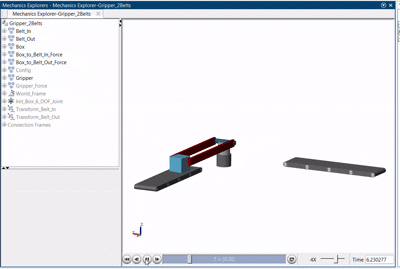
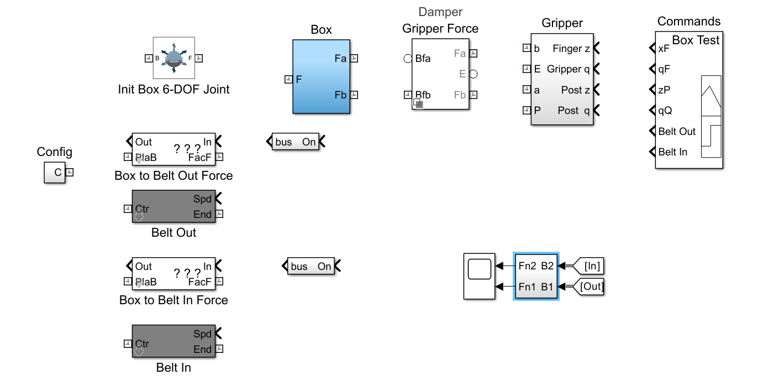
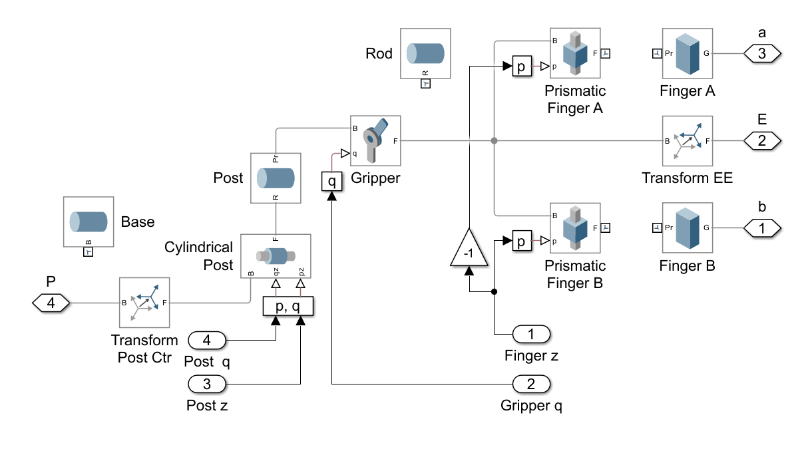
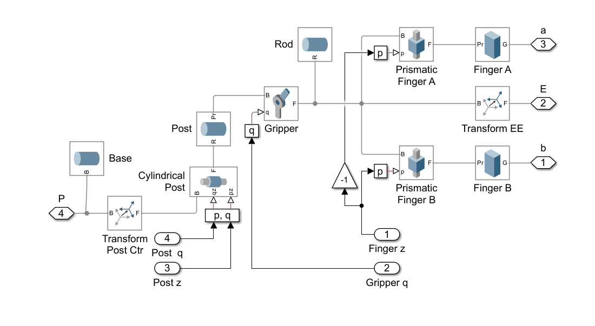
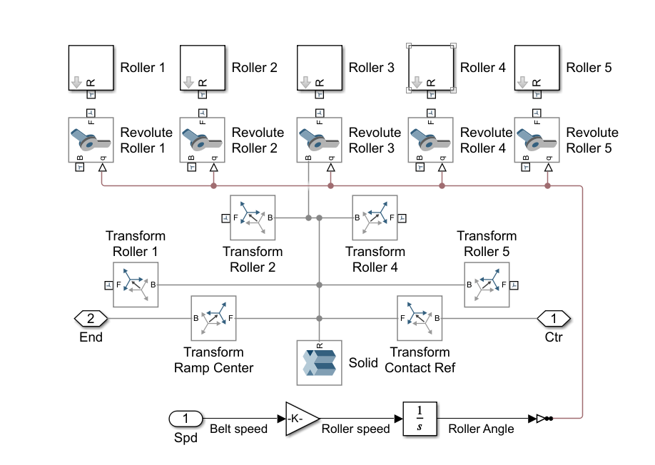
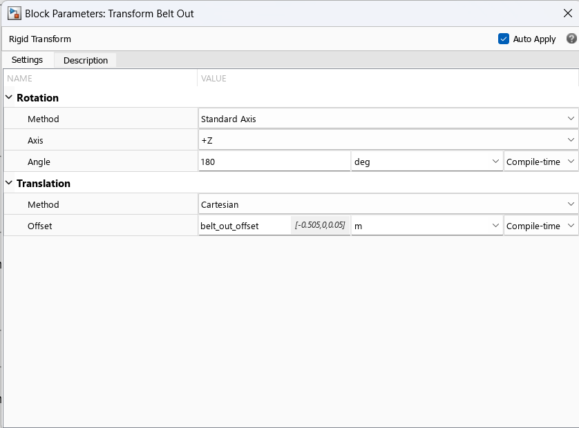
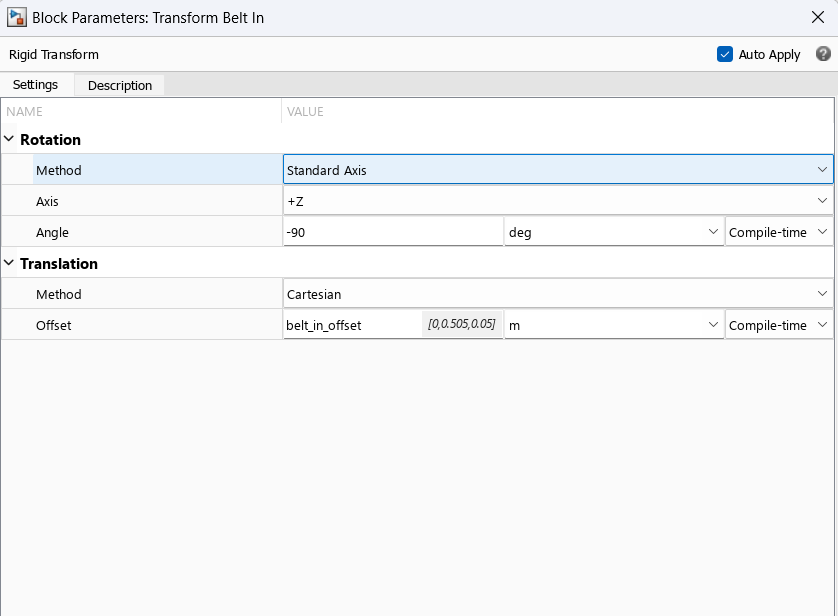

# Pick and Place — Recruitment Assignment

You've seen robotic arms on factory floors — grabbing, moving, and placing objects with mechanical precision. Now build one.

You're given a **Simscape Multibody model** of a pick-and-place system: a gripper arm riding on a post, and two conveyor belts bringing objects in and carrying them out. Every block you need is already in the file. Nothing is connected. When you run it, MATLAB will flood you with errors.

Your job is to understand what each block does, wire the system correctly, configure the transforms so the belts face the right direction, and get the whole thing running in 3D.

This is what you're working towards:



---

## Setup

### 1. Install the required toolboxes

You need these — no others, no shortcuts:

- MATLAB
- Simulink
- Simscape
- Simscape Multibody
- Simulink 3D Animation

Go to **Home → Add-Ons → Get Add-Ons** in MATLAB to install any you're missing. Without Simscape Multibody, none of the 3D blocks will load.

### 2. Add the repo to your MATLAB path

After cloning or extracting the repo, right-click the root folder in MATLAB's **Current Folder** panel and select **Add to Path → Selected Folders and Subfolders**.

### 3. Initialize the library

Run this in the MATLAB command window before opening anything:

```matlab
run('Pick_And_Place/Scripts_Data/startup_Contact_Forces_Library.m')
```

This registers the custom contact force library the model depends on. Skip this and you'll get missing block errors that have nothing to do with what you're supposed to fix.

This will open a blank webpage, you can ignore that and continue with your work.

### 4. Open the model

```
Pick_And_Place/Examples/3D/Gripper_2Belts/Gripper_2Belts.slx
```

Run it. You might come across errors like
```
Warning: The image file in 'image' drawing commands in block 'Gripper_2Belts/Box to Belt In Force' cannot be found on MATLAB path or has an invalid path. 
```
You can safely ignore them.
---

## What You're Starting With

This is the top-level model as you receive it — blocks present, nothing connected:



Five major components. Understand each before touching any wires.

**Gripper** — A post with a revolute joint carries a gripper head. Two fingers (A and B) are driven by prismatic joints. Finger A and Finger B move in opposite directions — a gain of −1 handles this. The gripper closes to grip the box, opens to release it.

**Box** — A rigid body with a 6-DOF joint. Contact forces between the box's bottom face and the belt surface make it move. The `Box to Belt Force` blocks compute these.

**Belt Out** — The outgoing conveyor. Five rollers driven by revolute joints. A speed signal drives rotation through a gain and integrator.

**Belt In** — The incoming conveyor. Same structure as Belt Out. **Already connected correctly** — use it as your reference.

**Commands** — The signal source. Sends timed position and velocity commands to the post, gripper, and belts.

---

## The Gripper Subsystem

The gripper has two plates that move toward each other to grip and apart to release. Linear motion comes from prismatic joints supported by a rod and post. The rod transfers motion; the post stabilizes the joints; the base anchors everything.

This is what you're given inside the Gripper block:



Study the block structure. This is what it should look like when correctly connected:



Key things to notice: the −1 gain that inverts the signal to Finger B so both fingers move symmetrically, how the Rod feeds both prismatic joints, and how the post position and gripper angle come in as separate inputs.

**To learn prismatic and revolute joints:**
→ [Prismatic Joint — MathWorks docs](https://www.mathworks.com/help/sm/ref/prismaticjoint.html)
→ [Revolute Joint — MathWorks docs](https://www.mathworks.com/help/sm/ref/revolutejoint.html)

---

## The Belt Subsystem

Each belt has five rollers, each connected to a revolute joint, each positioned by a rigid transform. The speed input at the bottom drives all rollers through a gain block and an integrator — converting belt speed into roller angle over time.

This is what Belt Out looks like when you open it — one connection is missing:



The hint to complete the Belt Out is that Belt In is already complete. Compare the two carefully and find what's different.

**To understand how the roller chain works:**
→ [Conveyor Belt example — MathWorks](https://www.mathworks.com/help/sm/ug/conveyor-belt.html)

---

## What to Add to the Top-Level Model

The top level is missing four blocks entirely. Add them yourself using the **Library Browser** (`Ctrl+Shift+L` or the book icon in the Simulink toolbar).

### World Frame

Search for `world frame` in the Library Browser. Add it to the top-level model. This is the ground reference — every physical mechanism in Simscape needs one to know where it exists in space.

→ [World Frame — MathWorks docs](https://www.mathworks.com/help/sm/ref/worldframe.html)

### Transform Belt Out

Search for `rigid transform`. Add one, name it `Transform Belt Out`. A Rigid Transform block sets the position and orientation of one frame relative to another — this is how you tell the model where the belt sits in 3D space and which way it faces.

Configure it as follows:



**180° rotation about +Z** — because the exit belt faces the opposite direction to the entry belt. Before typing those numbers, draw the coordinate frames on paper. If you can't explain why 180° and not 90°, you don't understand it yet.

→ [Rigid Transform — MathWorks docs](https://www.mathworks.com/help/sm/ref/rigidtransform.html)

### Transform Belt In

Add another `rigid transform`, name it `Transform Belt In`. Configure it as follows:



**−90° rotation about +Z** — to align the entry belt with the system's coordinate frame. Same exercise: draw it first, then configure.
(We have given you direct parameters for rigid transform cause we want to avoid for you getting stuck on this but we do expect for you to know what is a rigid transform🙂)
### Goto and Goto1

Goto blocks let you route signals between parts of a model without drawing wires across the canvas. A **Goto** tags a signal with a name; a **From** block anywhere in the model picks it up using the same tag.

Search for `goto` in the Library Browser. Add two.

Configure the first (`Goto`) as `Out` and second one (`Goto1`) as `In`. 

→ [Goto block — MathWorks docs](https://www.mathworks.com/help/simulink/slref/goto.html)

---

## Wiring the Top Level

Once all four blocks are added and configured, connect everything. This will be the ultimate test for you. The given hints below are good enough for you to net get lost whatsoever.

- The World Frame is the root. Everything physical(there are 4 blocks representing these physical things) in this model traces back to it through a chain of transforms. Follow that chain.

- The Force blocks have two inputs that need attention — a physical frame port (PlaB) and a contact parameter (FacF). If you see ??? on the block then for now you can ignore it, we are here to run the bot.

We want you all to think on these hints properly and do a bit of research on your own and you will be able to run the simulation🙂

**To understand the overall Simscape Multibody structure:**
→ [Getting Started with Simscape Multibody](https://www.mathworks.com/help/sm/getting-started-with-simscape-multibody.html)

**To understand how the box gets pushed by the belt (contact forces):**
→ Read `Pick_And_Place/CFL_Core/README_contact_forces_core.txt`

---

## Checking Your Work

After a successful simulation, run the plot script:

```matlab
run('Pick_And_Place/Examples/3D/Gripper_2Belts/Gripper_2Belts_plot1boxposition.m')
```

This plots the box's position over time. If pick-and-place worked, you'll see the box travel along the incoming belt, pause while the gripper closes, lift, move, and land on the outgoing belt.

- **Flat line** — the box never moved. Belt connections are wrong.
- **Position explodes** — a frame is pointing the wrong way. Check your transform rotations.
- **Smooth trajectory matching the gif** — you're done.

---

## Submission

Make a public folder in google drive containing:

```
/
├── Gripper_2Belts_solution.slx    ← your completed model
├── screen_recording.mp4           ← screen recording of the 3D simulation running
└── README.md                      ← explain how did you figured out the connections, what were each values representing.
```

The model must run from a single click of the **Run** button after `startup_Contact_Forces_Library.m` has been executed.

---

## Reference Links

| Topic | Link |
|---|---|
| Simscape Multibody — getting started | https://www.mathworks.com/help/sm/getting-started-with-simscape-multibody.html |
| Rigid Transform block | https://www.mathworks.com/help/sm/ref/rigidtransform.html |
| World Frame block | https://www.mathworks.com/help/sm/ref/worldframe.html |
| Prismatic Joint | https://www.mathworks.com/help/sm/ref/prismaticjoint.html |
| Revolute Joint | https://www.mathworks.com/help/sm/ref/revolutejoint.html |
| Goto block | https://www.mathworks.com/help/simulink/slref/goto.html |
| Contact Forces Library README | `Pick_And_Place/CFL_Core/README_contact_forces_core.txt` |